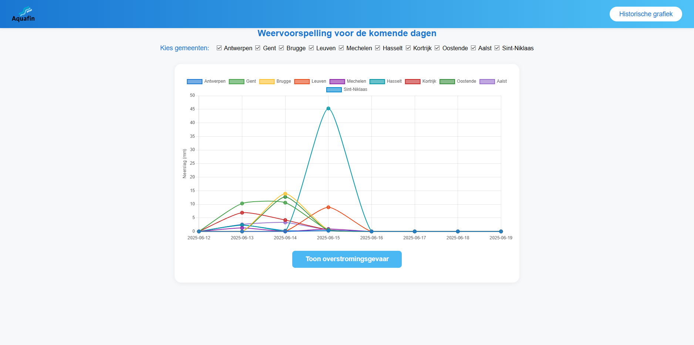
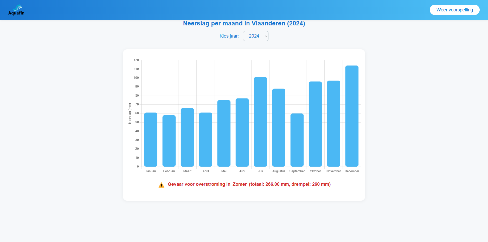

# Slimme Weersvoorspelling - Aquafin Overstroomingsrisicoanalyse

Een intelligente weersvoorspelling applicatie gebouwd met Spring Boot voor het Programming Project. Deze app is ontwikkeld voor Aquafin medewerkers om overstromingsrisico's te monitoren en weersvoorspellingen te bekijken voor heel Vlaanderen.

## Functionaliteiten

### Weersvoorspelling Dashboard
- Real-time weersvoorspellingen voor 10 grote Vlaamse steden
- 7-dagen voorspelling met neerslag, temperatuur en windsnelheid
- Interactieve grafieken met Chart.js
- Selecteerbare gemeenten via checkboxes
- Tooltip informatie met gedetailleerde weerdata

### Overstromingsrisicoanalyse
- Seizoensgebonden overstromingsdrempels
- Automatische risicobeoordeling per gemeente
- Waarschuwingssysteem met visuele indicatoren
- Real-time monitoring van neerslagaccumulatie
- Kleurgecodeerde waarschuwingen (groen=veilig, rood=gevaar)

### Historische Data Analyse
- Historische neerslagdata van 2005-2024
- Maandelijkse neerslagstatistieken per jaar
- Seizoensgebonden overstromingsanalyse
- Interactieve jaarSelectie
- Real-time data voor 2025 via Meteo.be API

### Gemeenten Coverage
Ondersteuning voor 10 grote Vlaamse gemeenten:
- **Antwerpen** (51.2194, 4.4025)
- **Gent** (51.0536, 3.7304)
- **Brugge** (51.2093, 3.2247)
- **Leuven** (50.8798, 4.7005)
- **Mechelen** (51.0257, 4.4776)
- **Hasselt** (50.9307, 5.3378)
- **Kortrijk** (50.8266, 3.2649)
- **Oostende** (51.2300, 2.9126)
- **Aalst** (50.9360, 4.0355)
- **Sint-Niklaas** (51.1651, 4.1431)

### API Integraties
- **Open-Meteo API**: Real-time weersvoorspellingen
- **Meteo.be API**: Officiële Belgische weerdata voor historische informatie
- **Flood Risk Assessment**: Interne algoritmes voor overstromingsrisico

## Screenshots

### Weersvoorspelling Dashboard
Het hoofddashboard toont de 7-dagen weersvoorspelling voor geselecteerde Vlaamse gemeenten met overstromingsrisicoanalyse.



### Historische Data Analyse
De historische pagina toont neerslagdata per maand met seizoensgebonden overstromingswaarschuwingen.



## Technische Implementatie

### Backend Architecture
- **Spring Boot 3.x** - Main application framework
- **Java 21** - Programming language
- **Maven** - Dependency management
- **Thymeleaf** - Template engine voor server-side rendering
- **Jackson** - JSON parsing voor API responses
- **HttpClient** - Voor externe API calls

### Models & Data Handling
- **APi.java** (`src/main/java/be/ehb/slimmeweervoospelling/model/APi.java`) - Meteo.be API integratie
- **WebsiteController.java** (`src/main/java/be/ehb/slimmeweervoospelling/Controllers/WebsiteController.java`) - Main controller en REST endpoints

#### Data Processing:
- **Weather Data**: Open-Meteo API voor real-time voorspellingen
- **Historical Data**: Embedded dataset 2005-2024 + live 2025 data
- **Flood Risk**: Seizoensgebonden algoritmes met drempelwaarden

### Frontend Implementation
- **HTML5** met Thymeleaf templating
- **CSS3** met moderne styling en responsive design
- **Vanilla JavaScript** voor interactiviteit
- **Chart.js** voor data visualisatie
- **Fetch API** voor asynchrone data loading

### Controllers & Endpoints
- **WebsiteController** - Hoofdpagina routing (`/`, `/weer`, `/History`)
- **NeerslagApiController** - REST API voor historische data (`/api/neerslag/2025`)
- **FloodRiskController** - Overstromingsrisico endpoints (`/flood-risk`)

### Flood Risk Algorithm
Het overstromingsrisicoalgoritme gebruikt seizoensgebonden drempelwaarden:
- **Winter** (Nov-Jan): 300mm drempel
- **Lente** (Feb-Apr): 250mm drempel
- **Zomer** (Mei-Jul): 260mm drempel
- **Herfst** (Aug-Okt): 280mm drempel

### External APIs
- **Open-Meteo**: `https://api.open-meteo.com/v1/forecast`
- **Meteo.be**: `https://opendata.meteo.be/service/ows` (WFS service)

## Project Structuur

```
Slimme-weersvoorspelling/
├── src/
│   ├── main/
│   │   ├── java/
│   │   │   └── be/ehb/slimmeweervoospelling/
│   │   │       ├── SlimmeWeervoospellingApplication.java
│   │   │       ├── Controllers/
│   │   │       │   └── WebsiteController.java
│   │   │       └── model/
│   │   │           └── APi.java
│   │   └── resources/
│   │       ├── static/
│   │       │   ├── style.css                # Main styling
│   │       │   ├── weer.js                  # Weather dashboard logic
│   │       │   ├── History.js               # Historical data logic
│   │       │   └── Images/
│   │       │       └── Logo_Aquafin.png     # Aquafin logo
│   │       ├── templates/
│   │       │   ├── weer.html                # Main weather dashboard
│   │       │   └── History.html             # Historical data page
│   │       └── application.properties       # Spring Boot configuration
│   └── test/
│       └── java/
│           └── be/ehb/slimmeweervoospelling/
│               └── SlimmeWeervoospellingApplicationTests.java
├── pom.xml                                  # Maven dependencies
└── README.md                                # Project documentation
```

## Installatie

### Vereisten
- Java 21 of hoger
- Maven 3.6+
- Internetverbinding voor API calls
- Moderne webbrowser met JavaScript ondersteuning

### Installatiestappen

1. **Clone de repository**
```bash
git clone [repository-url]
cd Slimme-weersvoorspelling
```

2. **Maven dependencies installeren**
```bash
mvn clean install
```

3. **Applicatie starten**
```bash
mvn spring-boot:run
```

4. **Applicatie bereiken**
```
http://localhost:1070
```

De applicatie draait standaard op poort 1070 zoals geconfigureerd in `application.properties`.

## Gebruiksaanwijzing

### Voor Aquafin Medewerkers

1. **Weersvoorspelling bekijken**:
   - Ga naar de hoofdpagina (`/` of `/weer`)
   - Selecteer gewenste gemeenten via checkboxes
   - Bekijk de 7-dagen voorspelling grafiek
   - Klik "Toon overstromingsgevaar" voor risicoanalyse

2. **Historische data raadplegen**:
   - Navigeer naar "Historische grafiek"
   - Selecteer gewenst jaar (2005-2025)
   - Bekijk maandelijkse neerslagdata
   - Let op seizoenwaarschuwingen onderaan

3. **Overstromingsrisico interpreteren**:
   - **Groene labels**: Geen overstromingsgevaar
   - **Rode labels met ⚠️**: Overstromingsrisico gedetecteerd
   - Drempelwaarden variëren per seizoen

## Algoritme Details

### Overstromingsrisico Berekening
```java
// Seizoensgebonden drempels
Winter (Nov-Jan): 300mm
Lente (Feb-Apr): 250mm  
Zomer (Mei-Jul): 260mm
Herfst (Aug-Okt): 280mm

// Risicobeoordeling
if (maandelijkse_neerslag >= seizoen_drempel) {
    return "⚠️ Overstromingsgevaar gedetecteerd";
} else {
    return "Geen overstromingsgevaar";
}
```

### Data Sources
- **Real-time weather**: Open-Meteo API (gratis, geen API key vereist)
- **Historical data**: Embedded dataset + Meteo.be API voor 2025
- **Coordinates**: GPS coördinaten voor alle ondersteunde gemeenten

## Technische Vereisten Implementatie

| Vereiste | Implementatie Locatie | Beschrijving |
|----------|----------------------|--------------|
| **Spring Boot** | `SlimmeWeervoospellingApplication.java` | Main application class |
| **Thymeleaf Templates** | `src/main/resources/templates/` | Server-side rendering |
| **REST API** | `WebsiteController.java` | `/api/neerslag/2025` endpoint |
| **External API Integration** | `APi.java` | Meteo.be API calls |
| **Responsive Design** | `style.css` | Mobile-first CSS |
| **Chart Visualization** | `Chart.js` | Interactive data graphs |
| **Async Data Loading** | `weer.js`, `History.js` | Fetch API implementation |
| **Error Handling** | Try-catch blocks | Graceful API failure handling |

## Extra Features

- **Real-time Updates**: Automatische data refresh voor actuele voorspellingen
- **Multi-city Support**: Simultane monitoring van meerdere gemeenten
- **Responsive Design**: Werkt op desktop, tablet en mobiel
- **Professional Branding**: Aquafin huisstijl en logo integratie
- **Performant Loading**: Asynchrone API calls voor snelle gebruikerservaring
- **Error Recovery**: Graceful handling van API failures
- **Accessibility**: Keyboard navigation en screen reader support
- **Data Persistence**: Historische data embedded voor offline access

## Gebruikte Technologieën

- **Backend**: Spring Boot 3.x, Java 21, Maven
- **Frontend**: HTML5, CSS3, Vanilla JavaScript
- **Data Visualization**: Chart.js
- **APIs**: Open-Meteo, Meteo.be WFS service
- **Styling**: Custom CSS met Aquafin kleuren
- **HTTP Client**: Java native HttpClient
- **JSON Processing**: Jackson ObjectMapper
- **Template Engine**: Thymeleaf

## Team & Context

**Team**: Group 5  
**Vak**: Programming Project  
**Opdrachtgever**: Aquafin  
**Doelgroep**: Aquafin medewerkers in heel Vlaanderen  
**Academiejaar**: 2024-2025  
**Hogeschool**: Erasmushogeschool Brussel

## Gebruikte Bronnen

- [Spring Boot Documentation](https://spring.io/projects/spring-boot)
- [Open-Meteo API Documentation](https://open-meteo.com/en/docs)
- [Meteo.be Open Data](https://opendata.meteo.be/)
- [Chart.js Documentation](https://www.chartjs.org/docs/)
- [Thymeleaf Documentation](https://www.thymeleaf.org/documentation.html)
- AI Assistants:
  - GitHub Copilot voor code suggestions en debugging tijdens development
  - ChatGPT voor algoritme optimalisatie en documentatie

## Aquafin Context

Aquafin is verantwoordelijk voor waterzuivering en waterbeheersing in Vlaanderen. Deze applicatie ondersteunt hun medewerkers bij:
- **Preventieve monitoring** van overstromingsrisico's
- **Operationele planning** gebaseerd op weersvoorspellingen  
- **Risicobeoordeling** voor infrastructuur en waterbeheersing
- **Data-driven besluitvorming** voor interventies

---
